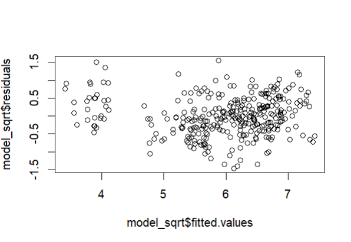

# Linear_Regression_Analysis

### Gerekli Paketleri Aktif Ediyoruz
```R

library(glmnet)
library(cli)
library(tidyverse)
library(modelr)
library(broom)
library(ISLR)
library(pscl)
library(ggplot2)
library(dplyr)
library(broom)
library(ggpubr)
library(ISLR)
library(mice)
library(lmtest)
library(car)
library(caret)
library(nlme)
```
```R
data <- Real.estate[c("transaction.date","house.age","metro_dist",
                      "market","latitude","longitude","price")]
names(data)
nrow(data)   # 414
View(data)
```

### Egitim Test Parcalamasi
```R
set.seed(150)
sampleIndex <- sample(1:nrow(data), size = 0.8*nrow(data))
trainset <- data[sampleIndex,]
testset <- data[-sampleIndex,]
nrow(trainset) ; nrow(testset)
```
### Korelasyonlari Inceleyelim
```R
cor(trainset)

                 transaction.date   house.age  metro_dist      market    latitude   longitude      price
transaction.date       1.00000000  0.04166675  0.05907234  0.02936047  0.03752253 -0.04642758  0.1007243
house.age              0.04166675  1.00000000  0.01737067  0.06723653  0.09906378 -0.04025992 -0.1916664
metro_dist             0.05907234  0.01737067  1.00000000 -0.61535615 -0.62338374 -0.79818893 -0.6584105
market                 0.02936047  0.06723653 -0.61535615  1.00000000  0.46075184  0.45471866  0.5477762
latitude               0.03752253  0.09906378 -0.62338374  0.46075184  1.00000000  0.41751240  0.5374921
longitude             -0.04642758 -0.04025992 -0.79818893  0.45471866  0.41751240  1.00000000  0.4992137
price                  0.10072428 -0.19166645 -0.65841050  0.54777625  0.53749208  0.49921366  1.0000000

## Metro_dist & price <-  -0.65841050 yani ev metrodan uzaklastikca fiyati duser
```


### Eksik Gozlem
```R
sum(is.na(trainset)) # 0
md.pattern(data)     # 0
```
### Model1 Kurulum
```R
model1 <- lm(price~., data = trainset)
summary(model1)
```
```R
Coefficients:
                   Estimate Std. Error t value Pr(>|t|)    
(Intercept)      -1.520e+04  8.157e+03  -1.863  0.06332 .  
transaction.date  5.939e+00  1.869e+00   3.177  0.00163 ** 
house.age        -2.678e-01  4.503e-02  -5.946 7.11e-09 ***
metro_dist       -4.688e-03  8.878e-04  -5.280 2.37e-07 ***
market            1.048e+00  2.307e-01   4.544 7.81e-06 ***
latitude          2.314e+02  5.618e+01   4.118 4.85e-05 ***
longitude        -2.050e+01  5.778e+01  -0.355  0.72295    
---
Signif. codes:  0 ‘***’ 0.001 ‘**’ 0.01 ‘*’ 0.05 ‘.’ 0.1 ‘ ’ 1

Residual standard error: 9.516 on 324 degrees of freedom
Multiple R-squared:  0.5484,	Adjusted R-squared:   0.54 
F-statistic: 65.57 on 6 and 324 DF,  p-value: < 2.2e-16

## p-value: < 2.2e-16 model anlamli, "longitude" haric tum degiskenler anlamli
```

### Model2 Kurulum
```R
model2 <- lm(price~transaction.date + house.age +metro_dist+
                market+latitude, data = trainset)
summary(model2)
```
```R
Coefficients:
                   Estimate Std. Error t value Pr(>|t|)    
(Intercept)      -1.774e+04  3.896e+03  -4.554 7.46e-06 ***
transaction.date  5.924e+00  1.867e+00   3.174  0.00165 ** 
house.age        -2.675e-01  4.497e-02  -5.949 6.97e-09 ***
metro_dist       -4.462e-03  6.163e-04  -7.239 3.29e-12 ***
market            1.053e+00  2.300e-01   4.577 6.71e-06 ***
latitude          2.346e+02  5.539e+01   4.235 2.97e-05 ***
---
Signif. codes:  0 ‘***’ 0.001 ‘**’ 0.01 ‘*’ 0.05 ‘.’ 0.1 ‘ ’ 1

Residual standard error: 9.503 on 325 degrees of freedom
Multiple R-squared:  0.5482,	Adjusted R-squared:  0.5412 
F-statistic: 78.87 on 5 and 325 DF,  p-value: < 2.2e-16

### Adjusted R-squared biraz artmis
```


### model1 ve model2 nin karsilastirmasi
```R
AIC(model1, k=8)  # 2487.714
AIC(model2, k=7)  # 2472.842    
BIC(model1)       # 2470.131       
BIC(model2)       # 2464.457

# model2 daha iyi gozukuyor
```

### Yeni testset ve trainset
```R
trainset2 <- trainset[,-6]
testset2 <- testset[,-6]
nrow(testset2)    # 83
nrow(trainset2)  # 331

```
### Price icin tahminler
```R
predictions <- predict(model2, testset2)
head(predictions)
```
### Aykiri Deger Kontrolu
```R
standardized_residuals <- rstandard(model2)
summary(standardized_residuals)
olcutIndex <- which(abs(standardized_residuals) > 2)
length(olcutIndex)
```
### Cook's Distance
```R
dist <- cooks.distance(model2)
olcut1 <- mean(dist)*3
olcut2 <- 4/length(dist)
olcut1 ; olcut2

olcut1Index <- which(dist > olcut1)
olcut2Index <- which(dist > olcut2)
length(olcut1Index)
length(olcut2Index)

outliers <- which(dist > olcut2 & abs(standardized_residuals) > 2)

trainsetrem <- trainset2[-outliers,]
nrow(trainset) # eski
nrow(trainsetrem) #yeni
```
### Yeni olusturdugumuz trainset ile yeni bir model olusturalim
```R
model3 <- lm(price~., data = trainsetrem)
predictions3 <- predict(model3,testset2) 
summary(model3) 
```
```R
                   Estimate Std. Error t value Pr(>|t|)    
(Intercept)      -1.423e+04  2.853e+03  -4.986 1.02e-06 ***
transaction.date  4.003e+00  1.373e+00   2.915  0.00381 ** 
house.age        -3.336e-01  3.397e-02  -9.822  < 2e-16 ***
metro_dist       -4.030e-03  4.492e-04  -8.972  < 2e-16 ***
market            1.064e+00  1.696e-01   6.276 1.16e-09 ***
latitude          2.488e+02  4.073e+01   6.107 3.00e-09 ***
---
Signif. codes:  0 ‘***’ 0.001 ‘**’ 0.01 ‘*’ 0.05 ‘.’ 0.1 ‘ ’ 1

Residual standard error: 6.876 on 313 degrees of freedom
Multiple R-squared:  0.6942,	Adjusted R-squared:  0.6893 
F-statistic: 142.1 on 5 and 313 DF,  p-value: < 2.2e-16

# model2: Adjusted R-squared:  0.5412 iken burada 0.6893
# degerine cikmis. Istenilen bir durum

# Residual standard error: 9.503  iken burada 6.876 
# degerine inmis. Istenilen bir durum
```
### Model Testi
```R
dwtest(model3)                    # p-value = 0.3224
# H0 ret edilemez. Hatalar iliskisiz

vif(model3) 
# degerler 1 ile 10 arasinda                       

shapiro.test(residuals(model3))   # p-value = 0.1921
# H0 ret edilemez. Normal dagilir  

bptest(model3,data = trainsetrem) # p-value = 0.01123
# H0 ret edilir degisen varyans durumu var. 
```
```
Heteroskedastisite sorununu duzeltebilmek icin bagimsiz degiskenin
karekokunu alacagiz
```

## Nihai Model
```R
model_sqrt <- lm(sqrt(price) ~ ., data = trainsetrem)
summary(model_sqrt)
```
```R
                   Estimate Std. Error t value Pr(>|t|)    
(Intercept)      -1.223e+03  2.278e+02  -5.369 1.55e-07 ***
transaction.date  3.362e-01  1.096e-01   3.068  0.00235 ** 
house.age        -2.593e-02  2.712e-03  -9.563  < 2e-16 ***
metro_dist       -3.812e-04  3.586e-05 -10.629  < 2e-16 ***
market            8.243e-02  1.354e-02   6.089 3.33e-09 ***
latitude          2.213e+01  3.252e+00   6.805 5.15e-11 ***
---
Signif. codes:  0 ‘***’ 0.001 ‘**’ 0.01 ‘*’ 0.05 ‘.’ 0.1 ‘ ’ 1

Residual standard error: 0.549 on 313 degrees of freedom
Multiple R-squared:  0.7315,	Adjusted R-squared:  0.7272 
F-statistic: 170.5 on 5 and 313 DF,  p-value: < 2.2e-16
```
```
Nihai Model
Multiple R-squared:  0.7315,	Adjusted R-squared:  0.7272 
Residual standard error: 0.549

Model 3
Multiple R-squared:  0.6942,	Adjusted R-squared:  0.6893  
Residual standard error: 6.876
```
### "Cok daha iyi model kurdugumuzu soyleyebiliriz"

### Ayiklama
```R
dist <- cooks.distance(model_sqrt)
olcut1 <- mean(dist)*3
olcut2 <- 4/length(dist)
olcut1 ; olcut2
olcut1Index <- which(dist > olcut1)
olcut2Index <- which(dist > olcut2)
length(olcut1Index)
length(olcut2Index)

outliers <- which(dist[1:length(standardized_residuals)] > olcut2 & 
                    abs(standardized_residuals) > 2)
```
### Grafik
```R
plot(model_sqrt$fitted.values,model3$residuals)
```

### Predictions
```R
predictions1 <- predict(model_sqrt, testset2)
```
### Normal Dagilim Var mı?
```R
qqnorm(residuals(model_sqrt),ylab = "residuals")
qqline(residuals(model_sqrt),col="red")
```


Var gibi duruyor emin olmak icin bir kac test daha yapabiliriz
### Model Testi
```R
bptest(model_sqrt,data = trainsetrem) # p-value = 0.05325
shapiro.test(residuals(model_sqrt))   # p-value = 0.9291
dwtest(model_sqrt)                    # p-value = 0.2559
vif(model_sqrt)                       # 1 ile 10 arasinda degerler

# H0 ları ret edecek yeterli kanit yok. Modelimiz testleri gecer
```
### Model Karsilastirmasi
```R
AIC(model_sqrt, k=6) # 558.5925
AIC(model3, k=6)     # 2171.352

BIC(modelsqrt)       # 556.9488
BIC(model3)          # 2169.709

# Nihai model cok daha iyi gozukuyor
```
```R
R2(predictions1,testset$price)        # 0.7824554
R2(predictions3,testset2$price)       # 0.7855279
```
```R
RMSE((predictions1)^2, testset$price) # 5.113167
RMSE(predictions3,testset2$price)     # 5.45638
```
```R
MAE((predictions1)^2, testset$price)  # 4.162743
MAE(predictions3,testset2$price)      # 4.492737
```
## Nihai nodel, model 3 ten daha iyi bir model diyebiliriz. 

